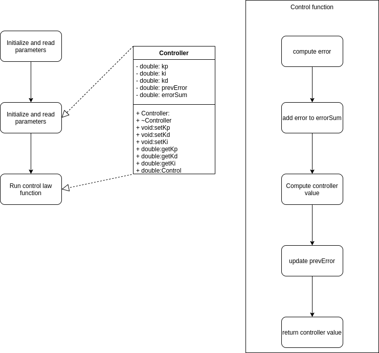

# C++ Boilerplate
[](https://travis-ci.org/clueless-bachu/PID_Controller)
[](https://coveralls.io/github/clueless-bachu/PID_Controller?branch=master)
---


## Author
Part 1:
Vasista Ayyaagri (Driver and Navigator; because I was not assigned a navigator)

Part 2:
Ajinkya Parwekar (Driver), Mahmoud Dahmani (Navigator)

## Overview

A PID Controller for velocity control. The UML diagram for the controller is as follows


## Discussions
We discussed about the design of the the software. A suggestion was forwarded about having the ability to access the control parameters which were private to dynamically change them. Another discussion was conducted on different naming conventions for class attributes

## Standard install via command-line
```
git clone --recursive https://github.com/dpiet/cpp-boilerplate
cd <path to repository>
mkdir build
cd build
cmake ..
make
Run tests: ./test/cpp-test
Run program: ./app/velControl
```